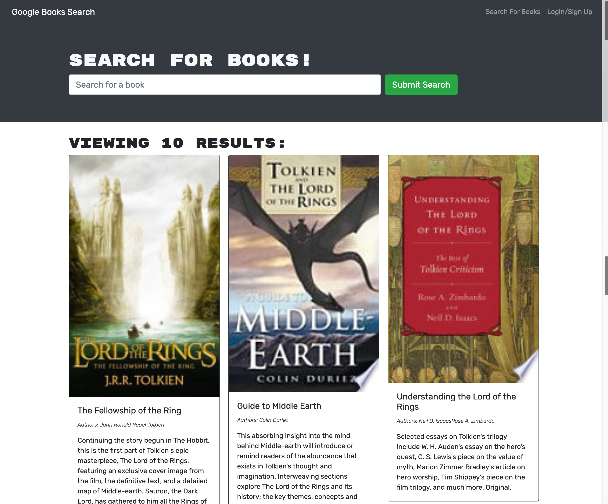

# Book Search Engine
  

## Description
Book Search Engine is a Google Books API powered search engine that was built with GraphQL and Apollo Server. It uses a React front-end that allows a user to search for books via keywords and add them to their 'saved books' section.

## Table of Contents
* [Installation](#Installation)
* [Built With](#Built-With)
* [Usage](#Usage)
   * [Video Demo](#Video-Demo)
* [License](#License)
* [Application Mockup](#Application-Mockup)
* [Contribution](#Contribution)

## Installation
Clone this repository. Using the command line, navigate to the root of the application and run `npm i` to install dependencies.

## Built With
* Node
* Apollo Server
* GraphQL
* MongoDB
* Mongoose
* JavaScript
* HTML 5
* React
* JSX

## Usage
The deployed application is simple to use and only requires the user to search for books in the search bar. The repository may be cloned and initiated locally by running `npm start` from the root of the navigation. 
    
### Live Application
The live application can be found on my [here](https://ucf-book-search-engine.herokuapp.com/).

## License
This application is under the [ISC](https://opensource.org/licenses/ISC) license.

## Application Mockup

## Contribution
* Starter Code from the [UCF Coding Boot Camp](https://github.com/coding-boot-camp/solid-broccoli).
* Enthusiastically built with plenty of coffee ☕ by [Ruben Matamoros](https://github.com/valiantcreative33).
